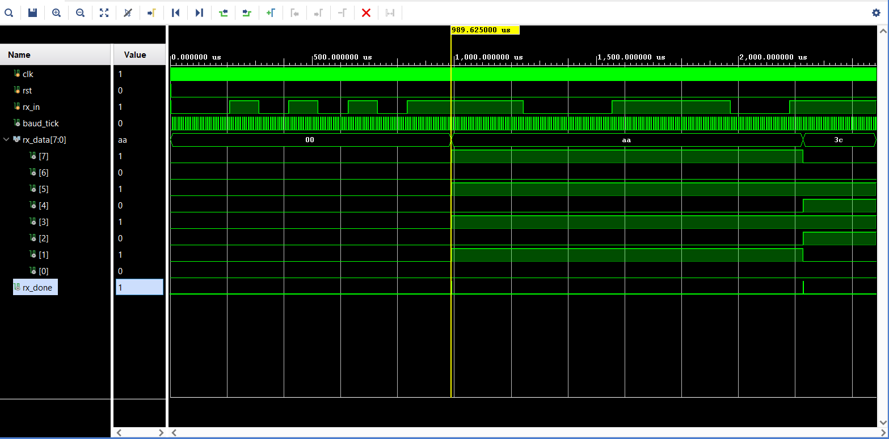
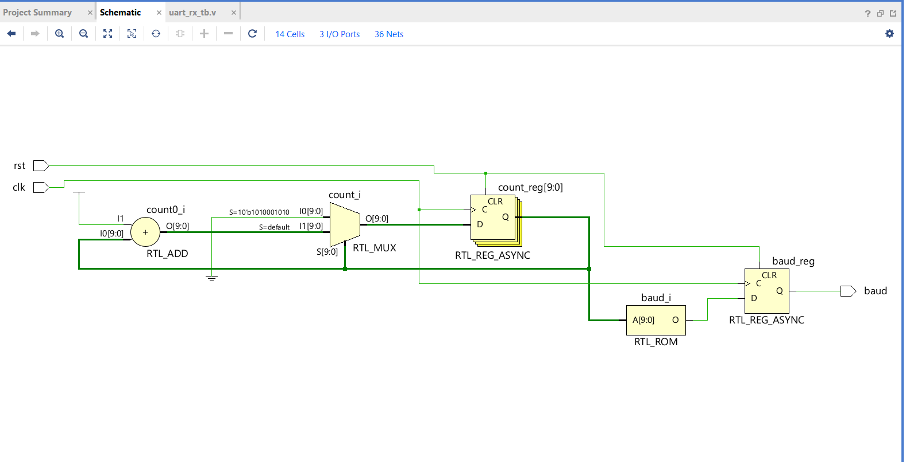

## UART Receiver (9600 Baud)

This module implements a UART Receiver with an oversampling baud rate generator and a Finite State Machine (FSM) to capture serial data.

### Hardware Verification & Schematics

**Behavioral Simulation (Waveform)**

**RTL Schematic (Elaborated Design)**
