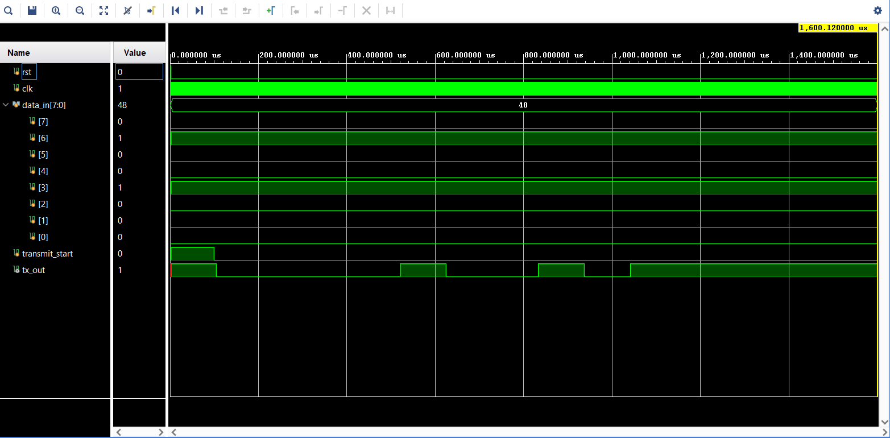
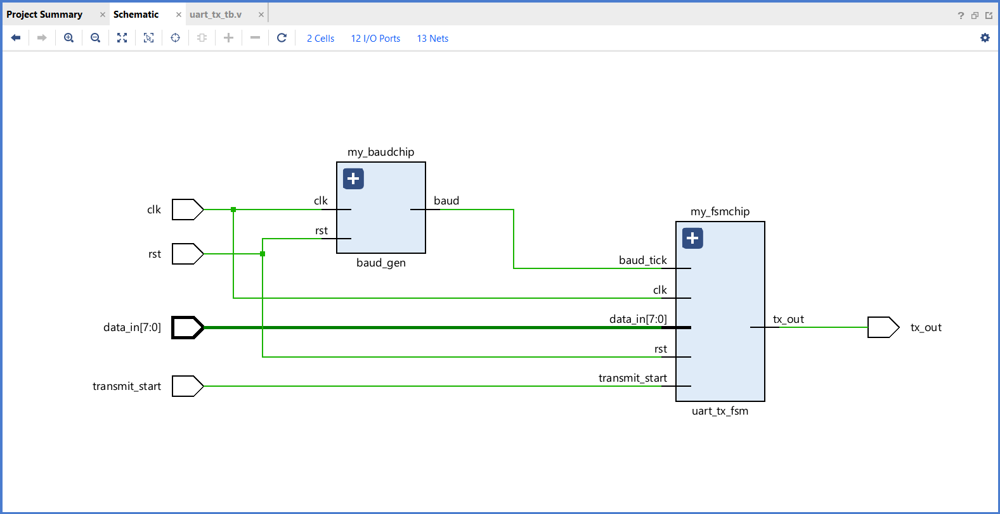

## UART Transmitter (9600 Baud)

This module implements a UART Transmitter utilizing a shift register and Finite State Machine (FSM) to serialize and transmit data frames.

### Hardware Verification & Schematics

**Behavioral Simulation (Waveform)**

**RTL Schematic (Elaborated Design)**
