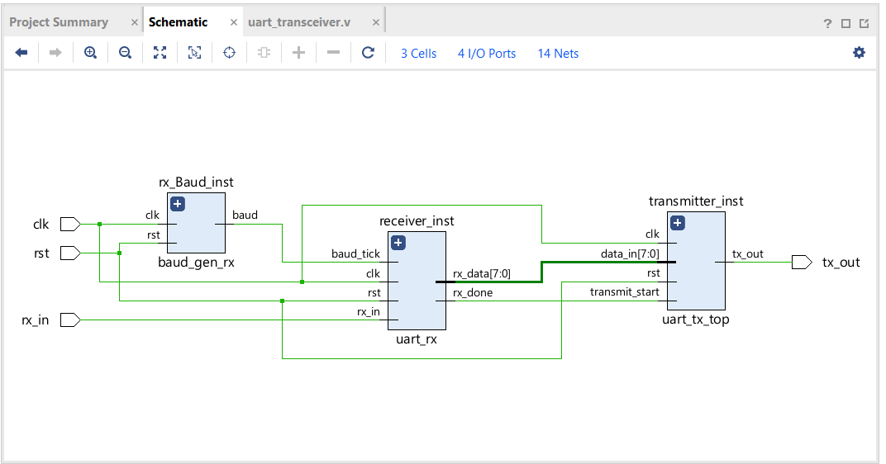
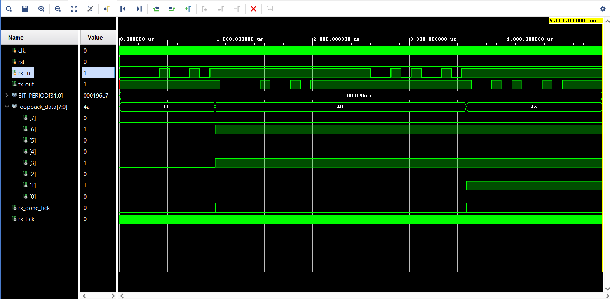

# UART Transceiver

## Overview
This project implements a full-duplex UART (Universal Asynchronous Receiver-Transmitter) transceiver in Verilog. It serves as Phase 2 of my digital logic portfolio, successfully integrating a UART Receiver and a UART Transmitter into a cohesive, top-level module capable of receiving serial data and echoing it back (Loopback Test).

## Architecture
The transceiver is built by bridging the following hardware modules:
*   **`uart_transceiver.v`**: The top-level wrapper that wires the receiver and transmitter together.
*   **`uart_rx.v`**: The receiver module (FSM) that safely samples and reads the incoming serial data.
*   **`uart_tx_top.v`**: The transmitter wrapper containing the transmit FSM and its dedicated baud generator.
*   **`baud_gen_rx.v`**: A dedicated baud generator for the receiver, utilizing 16x oversampling to accurately detect the center of incoming data bits.

### Hardware Schematic
Below is the RTL schematic showing the internal routing, specifically the `baud_gen_rx` feeding the 16x tick to the receiver, and the `rx_done` flag triggering the `uart_tx_top`:

## Key Technical Challenges Overcome
*   **16x Oversampling Integration**: Differentiating the baud rate logic between the transmitter (1 tick per bit) and the receiver (16 ticks per bit) to ensure the FSM accurately reads the start bits without drifting.
*   **Module Instantiation & Naming Collisions**: Debugging Vivado compilation errors caused by identical module names in separate directories and correctly isolating the clock domains for the `rx` and `tx` components.
*   **Git & EDA Tool Management**: Properly configuring `.gitignore` to keep the repository clean of heavy Vivado simulation caches and compiled indexes.

## Simulation & Verification
The behavioral simulation demonstrates a successful hardware loopback test. 
*   **Input Data**: `8'h48` (ASCII 'H') and `8'h4A` (ASCII 'J') are serially injected into the `rx_in` pin.
*   **Trigger**: The `rx_done_tick` fires precisely after the stop bit is processed, successfully latching the `loopback_data`.
*   **Output Data**: The transmitter immediately wakes up and perfectly echoes the bytes out across the `tx_out` wire.

### Waveform Results
